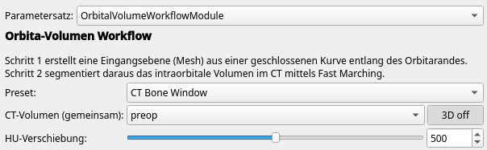
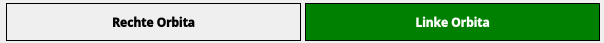
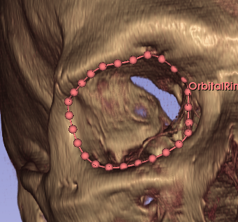

**Modul:** OrbitalVolumeWorkflowModule  
**Zweck:** Segmentierung des intraorbitalen Volumens aus CT-Datensätzen  
**Zielgruppe:** Klinisches Personal und Forscher im Bereich der Orbitachirurgie

---

# Voraussetzungen

- 3D Slicer (Version 5.0 oder neuer)
- CT-Datensatz in HU-kalibrierten Einheiten (DICOM oder NIfTI)
- Das Modul **OrbitalVolumeWorkflowModule** muss über den Extension Manager oder manuell geladen sein

---

# Überblick

Das Modul besteht aus zwei Schritten:

| Schritt | Aufgabe |
|---------|---------|
| **Schritt 1** | Zeichnen einer geschlossenen Kurve entlang des Orbitarandes → Erstellung eines Eintrittsebenenmeshes |
| **Schritt 2** | Segmentierung des intraorbitalen Volumens mittels Fast-Marching- oder Schwellenwert-Algorithmus |

Das Modul bietet zwei Segmentierungsmethoden:

| Methode | Beschreibung |
|---------|-------------|
| **Fast Marching** | Propagiert von einem Seed-Punkt aus durch das Weichgewebe; reagiert auf HU-Gradienten. Präziser, erfordert Seed-Konfiguration. |
| **Threshold** | Alle Voxel im Maskierzylinder innerhalb des HU-Fensters werden direkt segmentiert. Schneller, kein Seed nötig. |

Die Bearbeitung erfolgt seitengetrennt (linke / rechte Orbita).

---

# Schritt 0: Vorbereitung

1. CT-Datensatz in Slicer laden (Datei → Daten hinzufügen oder DICOM-Browser).
2. Das Modul **OrbitalVolumeWorkflowModule** öffnen.
3. Optional: Im Dropdown **Preset** einen Parametersatz auswählen (siehe unten). Das Modul startet mit dem Preset **CT Bone Window**.
4. Im Feld **CT Volume** den geladenen CT-Datensatz auswählen.

5. Optional: Mit dem Schieberegler **HU Shift** und dem Button **3D on** eine Volume-Rendering-Ansicht zur Orientierung aktivieren.

## Preset-Auswahl

Das Modul bietet vordefinierte Parametersätze, die HU-Fenster, Stopping Value und Speed Sigma in einem Schritt setzen:

| Preset | HU Min | HU Max | Stopping Value | Speed Sigma | Verwendung |
|--------|--------|--------|----------------|-------------|------------|
| **CT Bone Window** | −200 | 300 | 25 mm | 70 HU | Standardmäßiges diagnostisches CT |
| **Intraoperative CBCT** | −300 | 500 | 20 mm | 120 HU | Intraoperatives Cone-Beam-CT (höheres Rauschen, breiteres Intensitätsfenster) |
| **Manual** | – | – | – | – | Individuelle Einstellung ohne Überschreiben |

Beim Auswählen eines Presets erscheint eine Bestätigungsabfrage, bevor die Werte überschrieben werden.  
Sobald ein beliebiger Wert nachträglich manuell geändert wird, schaltet das Dropdown automatisch auf **Manual**.

---

# Schritt 1: Orbitarand-Kurve und Eintrittsebene

## 1.1 Seite auswählen

Wählen Sie zunächst die zu bearbeitende Seite durch Klick auf **Right Orbit** oder **Left Orbit**.  
Die aktive Seite wird grün hervorgehoben.

## 1.2 Geschlossene Kurve zeichnen

1. Klicken Sie auf **New Curve**, um eine neue geschlossene Kurve anzulegen.  
   Slicer wechselt automatisch in den Platzierungsmodus.
2. Setzen Sie Kontrollpunkte entlang des Orbitarandes in der axialen oder koronaren Schichtansicht.  
   Achten Sie darauf, den knöchernen Orbitarand vollständig zu umfahren.
3. Schließen Sie die Kurve, indem Sie auf den ersten Punkt klicken oder den Platzierungsmodus beenden.

**Einstellungen (optional):**

| Parameter | Bedeutung | Standardwert |
|-----------|-----------|--------------|
| Subdivision Distance (mm) | Abstand zwischen generierten Messpunkten auf dem Mesh | 1,0 mm |
| Smooth Iterations | Anzahl der Glättungsdurchläufe für das Mesh | 5 |

## 1.3 Eintrittsebene erstellen

Klicken Sie auf **Create Surface**.  
Das Modul berechnet aus der Kurve ein planares Mesh (Orbital Plane), das als anteriore Begrenzung der späteren Segmentierung dient.

> **Screenshot-Platzhalter:**  
> `[Screenshot: Erstelltes Orbital-Plane-Mesh in der 3D-Ansicht]`

Das Ergebnis (Anzahl Dreiecke und Punkte) wird im Modul angezeigt.  
Wiederholen Sie Schritt 1 für die Gegenseite.

---

# Schritt 2: Segmentierung des intraorbitalen Volumens

Wechseln Sie in Schritt 2 (Tab **Step 2: Segmentation**).

## 2.1 Orbital Plane auswählen

Wählen Sie im Feld **Orbital Plane (Mesh)** das in Schritt 1 erstellte Mesh der aktiven Seite aus.

## 2.2 HU-Fenster und Gewebeoptionen einstellen

| Parameter | Bedeutung | Standardwert |
|-----------|-----------|--------------|
| HU Min | Untergrenze des Gewebetyps (Weichgewebe / Fettgewebe) | −200 HU |
| HU Max | Obergrenze des Gewebetyps (Knochen wird ausgeschlossen) | +300 HU |
| **Treat air as soft tissue** | Luftgefüllte Voxel (< −500 HU) werden vor der Segmentierung in der Orbita-Region auf einen Weichgewebewert remappt. Verhindert, dass Luft als Barriere wirkt (z. B. bei Orbitafrakturen mit Pneumoorbita). | aus |

Das HU-Fenster begrenzt, in welchem Gewebetyp der Seed-Punkt gesucht bzw. das Threshold-Segment gebildet wird.  
Die Werte können schnell über das **Preset-Dropdown** (Schritt 0) gesetzt werden.

## 2.3 Seed-Einstellungen (Fast Marching)

> **Wichtig**:
> Die Seed-Einstellungen wirken nur bei der **Fast-Marching**-Methode. Beim Threshold-Verfahren wird kein Seed benötigt.

### Modus auswählen

Das Modul bietet drei Seed-Modi:

| Modus | Beschreibung |
|-------|-------------|
| **Manuell** | Ein einzelner Seed-Punkt auf der Orbitalachse |
| **Gegenseite spiegeln** | Die bereits segmentierte Gegenseite wird gespiegelt und als Startregion verwendet. Erfordert eine abgeschlossene Segmentierung der anderen Seite. |
| **Modellbasiert** | Ein extern geladenes Template-Volumen wird als Startregion positioniert |

> **Screenshot-Platzhalter:**  
> `[Screenshot: Seed-Modus Radiobuttons – Gegenseite gespiegelt ausgewählt]`

### Manueller Modus

- **Auto Seed:** Aktiviert → Seed-Punkt wird automatisch auf der Orbitalachse platziert  
- **Seed Offset (mm):** Abstand des automatischen Seed-Punktes vom Orbitarand-Zentrum (positiv = posterior)

### Modus „Gegenseite spiegeln"

Voraussetzung: Die Gegenseite muss bereits segmentiert worden sein.  
Der Algorithmus spiegelt das Gegenseiten-Volumen und zeigt es als blaue Vorschau an. Die gespiegelte Region wird direkt als Fast-Marching-Startregion verwendet.

> **Screenshot-Platzhalter:**  
> `[Screenshot: Blaue (gespiegelt) Vorschau-Segmentierung in der 3D-Ansicht]`

### Modellbasierter Modus

1. Klicken Sie auf **Load from file…**, um ein Template-Segmentierungsvolumen (.seg.nrrd, .nii.gz etc.) zu laden.
2. Wählen Sie das Template im Dropdown **Template segmentation** aus.
3. Optional: Klicken Sie auf **Mirror**, um das Template an der Mediansagittalebene zu spiegeln (z. B. wenn ein Rechts-Template für die linke Seite genutzt werden soll).
4. Klicken Sie auf **Position Model**.  
   Das Template wird automatisch am Orbitarand-Zentrum positioniert (mit 20 mm posteriorem Versatz).  
   In den 2D-Schichtansichten erscheinen Interaction-Handles zur manuellen Feinjustierung per Translation, Rotation und Skalierung.

> **Screenshot-Platzhalter:**  
> `[Screenshot: Positioniertes Template in der sagittalen Schichtansicht mit sichtbaren Interaction-Handles]`

## 2.4 Posteriore Begrenzung (erforderlich)

Klicken Sie auf den Platzierungsknopf neben **Cutoff-Punkt** und setzen Sie einen Markup-Punkt an der posterioren Orbitawand (z. B. am Apex orbitae in der sagittalen Ansicht).  
Die Tiefe der Orbita wird automatisch aus dem Abstand zwischen Cutoff-Punkt und Eintrittsebenenzentrum berechnet — kein manuelles Eintippen nötig.

Ein bereits in der Szene vorhandener Cutoff-Knoten kann über das Dropdown **Cutoff-Punkt** direkt zugewiesen und für beide Seiten wiederverwendet werden.

> **Hinweis:** Ohne gesetzten Cutoff-Punkt kann die Segmentierung nicht gestartet werden.

> **Screenshot-Platzhalter:**  
> `[Screenshot: Posteriorer Markup-Punkt in der sagittalen Ansicht]`

## 2.5 Segmentierungsparameter

| Parameter | Bedeutung | Empfohlener Wert |
|-----------|-----------|-----------------|
| Radius Margin (mm) | Sicherheitspuffer um den Orbitarand | 2 mm |
| Stopping Value | Maximale Ankunftszeit der Fast-Marching-Welle (niedrig = konservativ) | 25 (manuell) / 15 (gespiegelt / Modell) |
| Speed Sigma (σ) | Sigma des Gradienten-Geschwindigkeitsfeldes (höher = weichere Grenzen) | 70 |
| Posterior Boost | Verstärkungsfaktor posterior der Eintrittsebene | 2,5 |

> **Hinweis:** **Stopping Value** und **Speed Sigma** wirken nur bei der Fast-Marching-Methode. Die Orbital-Tiefe ergibt sich stets automatisch aus dem Cutoff-Punkt.

## 2.6 Nachbearbeitung: Satelliten entfernen

Aktivieren Sie **Remove satellite regions**, um nach der Segmentierung kleine isolierte Volumina (z. B. verbundene Ausläufer) automatisch zu entfernen.

| Parameter | Bedeutung | Standardwert |
|-----------|-----------|--------------|
| Min. Satellit-Ø (mm) | Maximaler Durchmesser, ab dem ein Satellit entfernt wird | 3,0 mm |

## 2.7 Segmentierung starten

Klicken Sie auf **Fast Marching** oder **Threshold**, um die Segmentierung mit der gewünschten Methode zu starten.  
Während der Berechnung zeigt ein Fortschrittsdialog den aktuellen Verarbeitungsschritt an.

Nach Abschluss erscheint ein Hinweisdialog. Prüfen Sie das Ergebnis in den Schichtansichten und der 3D-Ansicht:

- Ist das intraorbitale Volumen vollständig gefüllt?
- Gibt es Ausläufer in angrenzende Strukturen (Nasennebenhöhlen, Schädelinneres)?

> **Screenshot-Platzhalter:**  
> `[Screenshot: Segmentierungsergebnis nach dem ersten Durchlauf – Überprüfung in axialer und koronarer Ansicht]`

## 2.8 Nachbearbeitung nach der Segmentierung

Nach der Verifikation stehen folgende Schaltflächen zur Verfügung:

| Schaltfläche | Funktion |
|---|---|
| **Remove Extrusions** | Entfernt Ausläufer durch morphologisches Opening. Danach werden isolierte Inseln automatisch bereinigt – es bleibt die Insel erhalten, die dem Seed-Punkt bzw. Orbita-Zentrum am nächsten liegt. |
| **Remove Islands** | Behält manuell nur die korrekte Insel, falls nach dem Opening noch getrennte Komponenten vorhanden sind. Verwendet dieselbe ankerbasierte Logik wie der automatische Schritt. |
| **Crop Entrance Plane** | Beschneidet das Segment anterior anhand der Eintrittsebene, um anteriore Überlappungen zu entfernen. |

**Empfohlene Reihenfolge:**

1. Segmentierungsergebnis prüfen.
2. **Remove Extrusions** klicken → Ausläufer und isolierte Inseln werden automatisch entfernt.
3. Falls noch Inseln verbleiben: **Remove Islands** klicken.
4. **Crop Entrance Plane** klicken, um den anterioren Rand auf die Eintrittsebenentiefe zu begrenzen.

> **Screenshot-Platzhalter:**  
> `[Screenshot: Abgeschlossene Segmentierung nach Nachbearbeitung – sauberes Volumen in axialer und koronarer Ansicht]`

Das Ergebnis (Volumen in ml, Voxelanzahl) wird im Modul angezeigt.

### Segmentierungs-Node manuell zuweisen

Unterhalb der Schaltflächen **Fast Marching** / **Threshold** / **Clear** befindet sich das Dropdown **Segmentation:**.  
Hier kann ein bereits in der Szene vorhandener `vtkMRMLSegmentationNode` der aktiven Seite manuell zugewiesen werden.  
Bei Auswahl eines Nodes wird das Volumen des Segments „IntraorbitalVolume" sofort berechnet und angezeigt.  
Die Auswahl **„(none)"** hebt die Zuweisung auf.

> **Anwendungsfall:** Wenn eine Segmentierung extern erstellt oder aus einer anderen Sitzung geladen wurde und dem Workflow-Parameter-Set zugeordnet werden soll.

## 2.9 Manuelle Nachbearbeitung (optional)

Klicken Sie jederzeit auf **Edit in Segment Editor (Scissors)**, um die aktive Segmentierung manuell zu korrigieren.  
Das Volumen wird nach der Bearbeitung automatisch neu berechnet.

## 2.10 Ergebnisse exportieren

Klicken Sie auf **Export Results (Excel)**.  
Das Modul speichert eine Datei `results_orbital_volume.xlsx` im Verzeichnis des CT-Volumes des aktiven Parameter-Sets.

**Alle Parameter-Sets werden exportiert** – nicht nur das aktuell aktive.  
Für jedes Parameter-Set mit mindestens einer abgeschlossenen Segmentierung werden die entsprechenden Zeilen geschrieben.  
Beim wiederholten Export werden vorhandene Zeilen der betreffenden Parameter-Sets aktualisiert (nicht dupliziert).

**Spalten der Excel-Tabelle:**

| Spalte | Inhalt |
|--------|--------|
| Parameter-Node | Name des Parameter-Sets |
| CT-Volume | Name des CT-Datensatzes |
| Seite | Links / Rechts |
| Seed-Modus | Manuell / Gegenseite gespiegelt / Modellbasiert |
| Segmentierungsmethode | Fast Marching / Threshold |
| HU Min / Max | Gewebefenster |
| Stopping Value | Fast-Marching-Limit |
| Speed Sigma (σ) | Gradient-Sigma |
| Posteriorer Boost | Boost-Faktor |
| Satelliten entfernen | Ja / Nein |
| Min. Satelliten-Ø (mm) | Schwellwert Satellitenentfernung |
| Intraorbitalvolumen (ml) | Gemessenes Volumen |
| Gegenseite / Seite | Verhältnis der beiden Volumina (in %) |

> **Screenshot-Platzhalter:**  
> `[Screenshot: Excel-Datei mit exportierten Ergebnissen für zwei Seiten]`

---

# Tipps und Hinweise

- **Reihenfolge:** Beginnen Sie stets mit der weniger stark betroffenen / leichter zu segmentierenden Seite, da diese dann als Vorlage für die Gegenseiten-Spiegelung dienen kann.
- **Methodenwahl:** Verwenden Sie **Fast Marching** für präzise Fälle mit gutem Weichgewebekontrast. **Threshold** eignet sich als schnelle Alternative oder zur Verifikation.
- **Preset:** Verwenden Sie **CT Bone Window** für diagnostische CTs und **Intraoperative CBCT** für intraoperative Aufnahmen als Ausgangspunkt. Die Feinabstimmung erfolgt über die einzelnen Parameter – das Dropdown wechselt dabei automatisch auf **Manual**.
- **HU-Fenster:** Bei stark eingebluteten Orbitas ggf. HU Max auf 60–80 reduzieren, um Hämatome auszuschließen.
- **Treat air as soft tissue:** Aktivieren bei Pneumoorbita oder Frakturen mit Lufteintritt, damit Luft nicht als Barriere die Segmentierung unterbricht.
- **Stopping Value:** Bei Grenzüberschreitungen in den Nasennebenhöhlen den Wert reduzieren (z. B. von 25 auf 12).
- **Remove Extrusions:** Immer als ersten Nachbearbeitungsschritt ausführen – bereinigt Ausläufer und isolierte Inseln in einem Schritt.
- **Parameter-Sets:** Für jeden Patienten empfiehlt sich ein eigenes Parameter-Set (im Dropdown oben mit „+" erstellen), um die Einstellungen dauerhaft zu speichern. Der Export erfasst automatisch alle vorhandenen Parameter-Sets.
- **Export:** Da der Export alle Parameter-Sets einer Sitzung in dieselbe Datei schreibt, empfiehlt es sich, die Datei nach Abschluss aller Fälle umzubenennen oder an einen Zielordner zu verschieben.

---

# Fehlersuche

| Problem | Mögliche Ursache | Lösung |
|---------|-----------------|--------|
| Segmentierung läuft in die Nasennebenhöhlen | Stopping Value zu hoch oder Eintrittsebenen-Mesh nicht korrekt geschlossen | Stopping Value auf 12–15 reduzieren; Orbital-Plane-Mesh prüfen |
| Segmentierung unterbrochen durch Luft (Pneumoorbita) | Luftvoxel wirken als Barriere | **Treat air as soft tissue** aktivieren |
| Segmentierung nach Threshold zu groß | HU Max zu hoch – Knochen eingeschlossen | HU Max auf 200–250 reduzieren |
| Sehr kleines Segment bei Modell-Modus | Skalierung zu stark oder Modell außerhalb CT | Position Model erneut klicken, Template prüfen |
| Isolierte Inseln nach Remove Extrusions | Verbindung zwischen Insel und Hauptvolumen zu dünn | **Remove Islands** klicken |
| Kein Ergebnis nach Export | CT-Volume des aktiven Parameter-Sets hat keinen Dateipfad | CT-Datei auf Festplatte speichern oder Ausgabeverzeichnis manuell wählen |
| Export enthält nicht alle Fälle | Weitere Fälle sind in anderen Parameter-Sets | Sicherstellen, dass alle Parameter-Sets das Attribut „ModuleName" tragen (wird beim Erstellen im Modul automatisch gesetzt) |
| Schwarze Darstellung nach Mirror | Tritt nicht mehr auf (Normalen werden automatisch korrigiert) | – |
